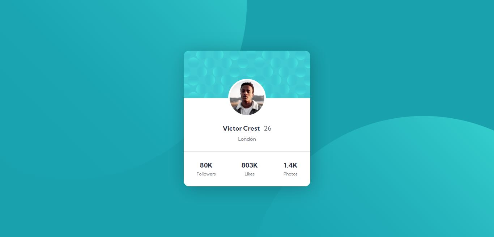
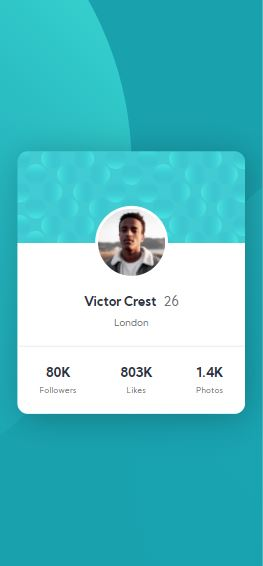

# Frontend Mentor - Profile card component solution

This is a solution to the [Profile card component challenge on Frontend Mentor](https://www.frontendmentor.io/challenges/profile-card-component-cfArpWshJ). Frontend Mentor challenges help you improve your coding skills by building realistic projects. 

## Table of contents

- [Overview](#overview)
  - [The challenge](#the-challenge)
  - [Screenshot](#screenshot)
  - [Links](#links)
- [My process](#my-process)
  - [Built with](#built-with)
- [Author](#author)

## Overview

### The challenge

I built this project to the design provided. due to structural simplicity, it was not necessary to use media queries to make the page responsive.

### Screenshot

#### Desktop

#### Mobile

### Links

- Solution URL: [https://www.frontendmentor.io/solutions/responsive-profile-card-component-EdoItPjn1](https://www.frontendmentor.io/solutions/responsive-profile-card-component-EdoItPjn1)
- Live Site URL: [NETLIFY](https://thirsty-bose-76552f.netlify.app/)

## My process

### Built with

- Semantic HTML5 markup
- CSS3

## Author

- Frontend Mentor - [@gustavoA7X612BR](https://www.frontendmentor.io/profile/gustavoA7X612BR)
- Instagram - [@gustavo.monteiro.68](https://www.instagram.com/gustavo.monteiro.68)
